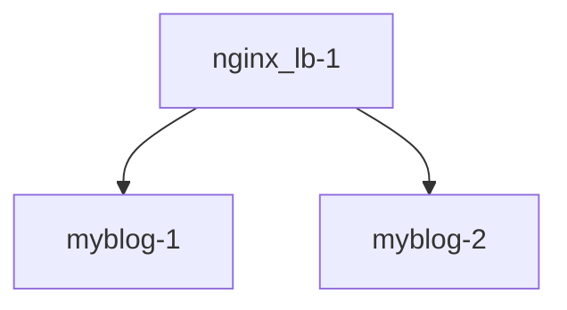

## 서비스 디스커버리 NGINX 버전 nginx -> ( httpd, httpd )

# Dockerfile

## 구조


## 첫번째 도커로 수동으로 LB GATEWAY 구성
```
$ docker build -t myblog:1.1.0 docker_file/httpd/
$ docker run -dit --name myblog-1 -p 8051:80 myblog:1.1.0
$ docker run -dit --name myblog-2 -p 8052:80 myblog:1.1.0

$ docker build -t nginx_lb:1.1.0 docker_file/nginx/ # https://docs.docker.com/engine/reference/commandline/run/#options $ docker run --name nginx_lb-1 -d -p 9051:80 --link myblog-1 --link myblog-2 nginx_lb:1.1.0

# 확인
# http://localhost:9091 반복 접근
$ sudo docker logs -f myblog-1
$ sudo docker logs -f myblog-2
```

## Rolling Deploy ( Update )
- 요구사항 : 블로그 디자인 바뀜 / 무중단 업데이트 해야함
- 바뀐 블로그 : https://github.com/diginori/diginori.github.io
- 바뀐 블로그 로컬 심플테스트 : python3 -m http.server 9876
```bash
# Dockerfile 변경
$ cat docker_file/httpd/Dockerfile | grep clone
#RUN ["git", "clone", "https://github.com/dMario24/dMario24.github.io.git", "/usr/local/apache2/app/blog"]
RUN ["git", "clone", "https://github.com/diginori/diginori.github.io", "/usr/local/apache2/app/blog"]

# 블로그 소스코드를 바꾸고 다시 빌드 -> 2.0.0 으로 함
$ docker build -t myblog:2.0.0 docker_file/httpd/

# 순차적으로 1번을 내리고 새로운 1번으로 바꿈
$ docker stop myblog-1; docker rm myblog-1

# 바뀐 소스코드가 적용된 도커 컨테이너 가동 8501 로 확인
$ docker run -dit --name myblog-1 -p 8051:80 myblog:2.0.0

# myblog-2 도 위와 같은 순서로 교체
$ docker stop myblog-2;docker rm myblog-2
$ docker run -dit --name myblog-2 -p 8052:80 myblog:2.0.0

# LB 로 확인 = 끝
```

## 블루/그린 배포
```bash
# 새로운 버전을 따로 만들어 둔다.
$ docker run -dit --name myblog-1-v1 -p 8151:80 myblog:1.1.0
$ docker run -dit --name myblog-2-v1 -p 8152:80 myblog:1.1.0

# 서버가 스탠바이 상태가 추가되어 2배로 늘어났다
$ sudo docker ps
CONTAINER ID   IMAGE            COMMAND                  CREATED          STATUS          PORTS                                     NAMES
c25ceae3fe78   myblog:1.1.0     "/bin/sh -c 'service…"   7 seconds ago    Up 6 seconds    0.0.0.0:8152->80/tcp, [::]:8152->80/tcp   myblog-2-v1
582229ab2c05   myblog:1.1.0     "/bin/sh -c 'service…"   20 seconds ago   Up 19 seconds   0.0.0.0:8151->80/tcp, [::]:8151->80/tcp   myblog-1-v1
aadc09a80d45   myblog:2.0.0     "/bin/sh -c 'service…"   9 minutes ago    Up 9 minutes    0.0.0.0:8052->80/tcp, [::]:8052->80/tcp   myblog-2
49806690222c   myblog:2.0.0     "/bin/sh -c 'service…"   13 minutes ago   Up 13 minutes   0.0.0.0:8051->80/tcp, [::]:8051->80/tcp   myblog-1
10ea361d27e5   nginx_lb:1.1.0   "/docker-entrypoint.…"   21 minutes ago   Up 21 minutes   0.0.0.0:9051->80/tcp, [::]:9051->80/tcp   nginx_lb-1

# 기존 서비스를 죽임
$ docker stop myblog-1 myblog-2;docker rm myblog-1 myblog-2

# 스텐바이 상태의 서비스를 이동
$ docker rename myblog-1-v1 myblog-1
$ docker rename myblog-2-v1 myblog-2

# --link 를 사용하면서 정상 동작 하지 않는 것으로 보임
# --network 를 사용해서 다시 해보겠다

$ docker network create sky-net
$ docker network connect sky-net myblog-1
$ docker network connect sky-net myblog-2
$ docker network connect sky-net nginx_lb-1
```

## 블루 그랜 --network 를 사용하여 다시 해보자
```bash
$ docker network create sky-net
$ docker run -dit --name myblog-2 -p 8152:80 --network sky-net myblog:1.1.0
$ docker run -dit --name myblog-1 -p 8151:80 --network sky-net myblog:1.1.0

# LB 도 sky-net 네트워크 안으로 넣어서 생성
$ docker run --name nginx_lb-1 -d -p 9051:80 --network sky-net nginx_lb:1.1.0

# 새로 배포되는 서비스를 -2 를 붙여서 만들고 network 안에 넣는다
$ docker run -dit --name myblog-2-2 --network sky-net myblog:2.0.0
6b03eb7568124f570991bf202ff6cf9e2ba808aa7579625e65db925d32f6fda1
$ docker run -dit --name myblog-1-2 --network sky-net myblog:2.0.0
20190cea9204dc9bb72facce3b023eee2e4a48fa3577166554514d27f217ec1b

# nginx 컨테이너로 들어가서 LB 설정을 바꾸어줌
upstream blog_servs {
        #server myblog-1:80;
        #server myblog-2:80;
        server myblog-1-2:80;
        server myblog-2-2:80;
}

# nginx reload 로 위 설정 적용
root@843f18831872:/etc/nginx/conf.d# nginx -s reload
2025/10/15 05:20:47 [notice] 194#194: signal process started

# 다시 nginx 컨테이너 밖으로 나와서 이제 연결 되지 않은 구 버전 블로그는 삭제
$ docker stop myblog-1 myblog-2
$ docker rm myblog-1 myblog-2

```

# docker compose

```bash
# https://docs.docker.com/compose/reference/
$ docker compose -f docker_file/docker-compose.yml up -d

$ docker compose -f docker_file/docker-compose.yml ls
NAME                STATUS              CONFIG FILES
dmario24_lb         running(3)          /home/tom/code/k9s/docker_file/docker-compose.yml

$ docker compose -f docker_file/docker-compose.yml stop

$ docker compose -f docker_file/docker-compose.yml start

$ docker compose -f docker_file/docker-compose.yml down

$ docker compose -f docker_file/docker-compose.yml images
```

# scale in/out

- [ ] https://docs.docker.com/compose/compose-file/deploy/#replicas
- [ ] https://docs.docker.com/engine/reference/commandline/compose_up/#options


```bash
$ docker compose up -d --scale blog=5
```

# compose command

#### up

- [ ] docker compose up --help
- [ ] https://docs.docker.com/engine/reference/commandline/compose_up/

```
-d: (docker run -d 옵션 처럼) 서비스 실행이 데몬으로 실행됨
--build: 서비스 (다시)시작 하고 이미지를 새로 만듬(Dockerfile 이 변경되는 경우 사용)
--force-recreate: 컨테이너를 지우고 새로 만듬
```

#### ps

- 현재 환경에서 실행 중인 각 서비스의 상태를 보여줍니다.

#### stop, start

- 서비스를 멈추거나, 멈춰 있는 서비스를 시작합니다.

#### down

- 서비스를 지웁니다. 컨테이너와 네트워크를 삭제하며, 옵션(--volume)에 따라 볼륨도 지웁니다.

#### logs

- 서비스의 로그를 확인할 수 있습니다. logs 뒤에 서비스 이름을 적지 않으면 도커 컴포즈가 관리하는 모든 서비스의 로그를 함께 보여줍니다.


# Use famous Jwilder nginx proxy
### scale out/in -> auto lb
- https://stackoverflow.com/questions/50203408/docker-compose-scale-x-nginx-conf-configuration
- https://github.com/nginx-proxy/nginx-proxy
- chrome 브라우저에서 http://aws.google.com:99889 확인 위해 window hosts 파일 수정필요


``` bash
$ docker compose -f compose/auto_lb/compose.yml  up -d --build --force-recreate

$ docker compose -f compose/auto_lb/compose.yml ls                             
NAME                STATUS              CONFIG FILES
awsgoo              running(2)          /home/tom/code/k9s/compose/auto_lb/compose.yml

$ docker compose -f compose/auto_lb/compose.yml  up -d --scale blog=5

docker compose -f compose/auto_lb/compose.yml ps
NAME                   IMAGE                    COMMAND                  SERVICE             CREATED              STATUS              PORTS
awsgoo-blog-1          awsgoo-blog              "/bin/sh -c 'service…"   blog                About a minute ago   Up About a minute   80/tcp
awsgoo-blog-2          awsgoo-blog              "/bin/sh -c 'service…"   blog                19 seconds ago       Up 17 seconds       80/tcp
awsgoo-blog-3          awsgoo-blog              "/bin/sh -c 'service…"   blog                19 seconds ago       Up 16 seconds       80/tcp
awsgoo-blog-4          awsgoo-blog              "/bin/sh -c 'service…"   blog                19 seconds ago       Up 17 seconds       80/tcp
awsgoo-blog-5          awsgoo-blog              "/bin/sh -c 'service…"   blog                19 seconds ago       Up 16 seconds       80/tcp
awsgoo-nginx-proxy-1   nginxproxy/nginx-proxy   "/app/docker-entrypo…"   nginx-proxy         About a minute ago   Up About a minute   0.0.0.0:9889->80/tcp
```
