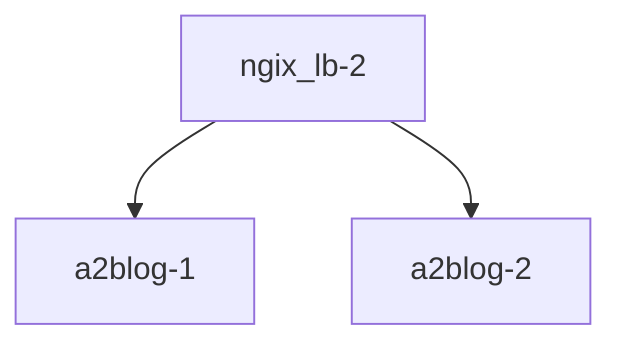

## 서비스 디스커버리 NGINX 버전 nginx -> ( httpd, httpd )

# Dockerfile



```
$ docker build -t a2blog:1.1.0 docker_file/httpd/
$ docker run -dit --name a2blog-1 -p 8051:80 a2blog:1.1.0
$ docker run -dit --name a2blog-2 -p 8052:80 a2blog:1.1.0

$ docker build -t nginx_lb:1.1.0 docker_file/nginx/
$ docker run --name ngix_lb-1 -d -p 9051:80 nginx_lb:1.1.0

# https://docs.docker.com/engine/reference/commandline/run/#options
$ docker run --name ngix_lb-2 -d -p 9052:80 --link a2blog-1 --link a2blog-2 nginx_lb:1.1.0
```

# docker compose

```bash
# https://docs.docker.com/compose/reference/
$ docker compose -f docker_file/docker-compose.yml up -d

$ docker compose -f docker_file/docker-compose.yml ls
NAME                STATUS              CONFIG FILES
dmario24_lb         running(3)          /home/tom/code/k9s/docker_file/docker-compose.yml

$ docker compose -f docker_file/docker-compose.yml stop

$ docker compose -f docker_file/docker-compose.yml start

$ docker compose -f docker_file/docker-compose.yml down

$ docker compose -f docker_file/docker-compose.yml images
```

# scale in/out

- [ ] https://docs.docker.com/compose/compose-file/deploy/#replicas
- [ ] https://docs.docker.com/engine/reference/commandline/compose_up/#options


```bash
$ docker compose up -d --scale blog=5
```

# compose command

#### up

- [ ] docker compose up --help
- [ ] https://docs.docker.com/engine/reference/commandline/compose_up/

```
-d: (docker run -d 옵션 처럼) 서비스 실행이 데몬으로 실행됨
--build: 서비스 (다시)시작 하고 이미지를 새로 만듬(Dockerfile 이 변경되는 경우 사용)
--force-recreate: 컨테이너를 지우고 새로 만듬
```

#### ps

- 현재 환경에서 실행 중인 각 서비스의 상태를 보여줍니다.

#### stop, start

- 서비스를 멈추거나, 멈춰 있는 서비스를 시작합니다.

#### down

- 서비스를 지웁니다. 컨테이너와 네트워크를 삭제하며, 옵션(--volume)에 따라 볼륨도 지웁니다.

#### logs

- 서비스의 로그를 확인할 수 있습니다. logs 뒤에 서비스 이름을 적지 않으면 도커 컴포즈가 관리하는 모든 서비스의 로그를 함께 보여줍니다.


# Use famous Jwilder nginx proxy
### scale out/in -> auto lb
- https://stackoverflow.com/questions/50203408/docker-compose-scale-x-nginx-conf-configuration
- https://github.com/nginx-proxy/nginx-proxy
- chrome 브라우저에서 http://aws.google.com:99889 확인 위해 window hosts 파일 수정필요


``` bash
$ docker compose -f compose/auto_lb/compose.yml  up -d --build --force-recreate

$ docker compose -f compose/auto_lb/compose.yml ls                             
NAME                STATUS              CONFIG FILES
awsgoo              running(2)          /home/tom/code/k9s/compose/auto_lb/compose.yml

$ docker compose -f compose/auto_lb/compose.yml  up -d --scale blog=5

docker compose -f compose/auto_lb/compose.yml ps
NAME                   IMAGE                    COMMAND                  SERVICE             CREATED              STATUS              PORTS
awsgoo-blog-1          awsgoo-blog              "/bin/sh -c 'service…"   blog                About a minute ago   Up About a minute   80/tcp
awsgoo-blog-2          awsgoo-blog              "/bin/sh -c 'service…"   blog                19 seconds ago       Up 17 seconds       80/tcp
awsgoo-blog-3          awsgoo-blog              "/bin/sh -c 'service…"   blog                19 seconds ago       Up 16 seconds       80/tcp
awsgoo-blog-4          awsgoo-blog              "/bin/sh -c 'service…"   blog                19 seconds ago       Up 17 seconds       80/tcp
awsgoo-blog-5          awsgoo-blog              "/bin/sh -c 'service…"   blog                19 seconds ago       Up 16 seconds       80/tcp
awsgoo-nginx-proxy-1   nginxproxy/nginx-proxy   "/app/docker-entrypo…"   nginx-proxy         About a minute ago   Up About a minute   0.0.0.0:9889->80/tcp
```
